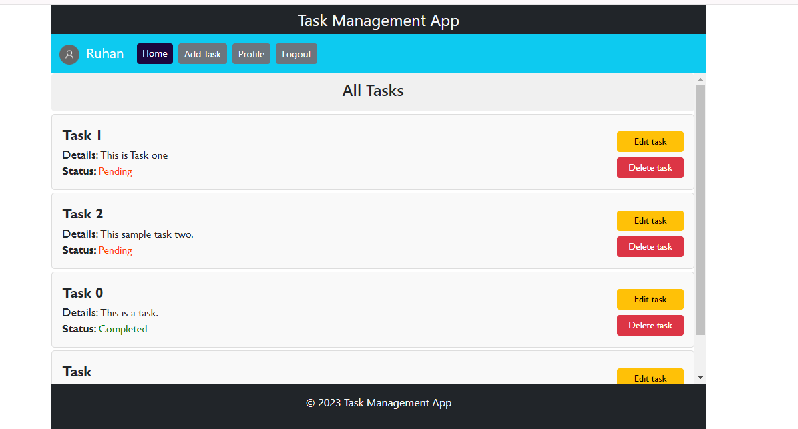
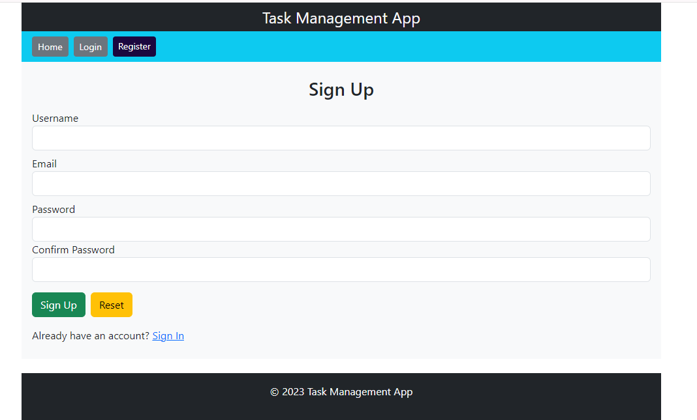
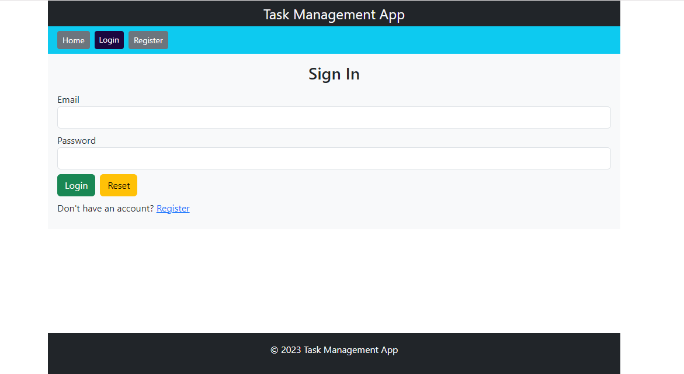
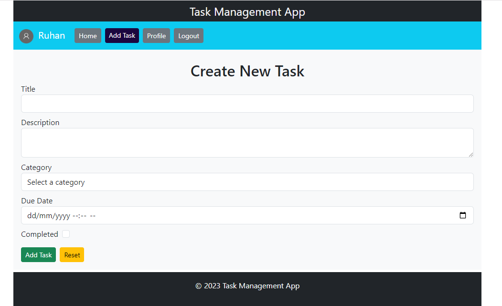

# Task Management System

Task Management System is a web application built with Django REST Framework for the backend and React.js for the frontend. It provides a platform for managing tasks efficiently, enabling users to create, update, and delete tasks, manage user profiles, and authenticate securely.

## Table of Contents

- [Task Management System](#task-management-system)
  - [Table of Contents](#table-of-contents)
  - [Features](#features)
  - [Installation](#installation)
  - [Usage](#usage)
  - [Preview](#preview)

## Features

- User Creation and Authentication: Users can create accounts and authenticate securely using JSON Web Tokens (JWT).
- Task CRUD Operations: Users can perform CRUD (Create, Read, Update, Delete) operations on tasks, including creating new tasks, viewing task details, updating task information, and deleting tasks.
- User Profile Management: Users can manage their profiles, including updating profile information such as username, email, and password.
- JWT Authentication: Simple JWT is used for token-based authentication, ensuring secure access to the application's resources.

## Installation

* Python 3.11.1
* Django 5.0
* Django Rest Framework 3.14
* Node js 18.13.0 and npm
* React Js 18.2

## Usage

+ Register a new account or login with existing credentials.
+ Create tasks by providing task details such as title, description, etc.
+ View and manage tasks from the dashboard.
+ Update task details or delete tasks as needed.
+ Manage user profile by updating information.

## Preview

